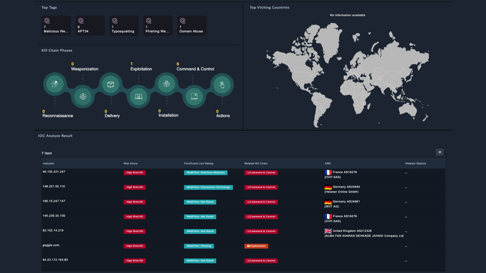

# Release Information

- **Version**:  1.0.0
- **Certified**: Yes
- **Publisher**: Fortinet
- **Compatible Version**: FortiSOAR v7.6.1 and later

# Overview

**Unleash the Power of Threat Intelligence with Our FortiGuard Labs IOC Search Solution Pack**

Empower your SOC analysts with unparalleled visibility into malicious indicators using the FortiGuard Labs IOC Search Solution Pack. This innovative solution seamlessly integrates the powerful capabilities of FortiGuard Labs into FortiSOAR, delivering actionable threat intelligence at your fingertips.

- **Comprehensive IOC Insights**: Access a wealth of global cyber threat intelligence gathered from FortiGuard’s extensive network of over 3 million sensors, proprietary AI-driven web crawlers, and strategic threat-sharing alliances.

- **Advanced Threat Context**: Dive deep into detailed IOC profiles, including live risk ratings, kill chain phases, and hosting risk profiles—helping your team pinpoint threats quickly and accurately.

- **Streamlined Investigations**: Utilize our intuitive interface to search and analyze IOCs effortlessly. Enhance workflows by correlating high-risk indicators with ongoing investigations and incidents.

- **Enhanced Security Operations**: Directly export critical IOC data or link records to existing cases, empowering analysts to act faster and smarter when responding to threats.

- **Seamless Integration**: Designed to integrate with FortiAnalyzer, FortiGate Cloud, and FortiSIEM, this solution pack ensures that your organization benefits from a unified security ecosystem.

---

Elevate your threat-hunting capabilities with the FortiGuard Labs IOC Search Solution Pack—turning insights into decisive action.

# Next Steps

| [Installation](./docs/setup.md#installation) | [Configuration](./docs/setup.md#configuration) | [Usage](./docs/usage.md) | [Contents](./docs/contents.md) |
|----------------------------------------------|------------------------------------------------|--------------------------|--------------------------------|