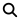

| [Home](../README.md) |
|----------------------|

# Usage

On the IOC search page, enter indicators separated by a line break. Maximum of 10 indicators are allowed. Click the button  **Search** when done.

As an example let's enter the following indicators in the **IOC Search** box and click **Search**:

```
goggle.com
46.105.221.247
148.251.55.110
185.15.247.147
145.239.33.100
82.102.14.219
94.23.172.164:80
```
The following is the results page after searching for these IOCs:


**Spam Sender IP Category**

Indicates whether the IP was involved in spam sending activities.

**IOC Confidence**

For a known IOC, it indicates the level of confidence in the correctness of the indicator.
- **low** - likely clean
- **medium** - suspicious
- **high** - malicious with strong evidence.

**IOC**

The indicator matched in the database given a search query.

**IOC Tags**

A tag serves as a label to provide context and easy retrieval of tagged items.

There are several threat tags defined by FortiGuard analysts:

| Tag                             | Description                                                           |
|:--------------------------------|:----------------------------------------------------------------------|
| Malicious Websites              | Sites with malicious intent related to malware.                       |
| Phishing Websites               | Credential harvesting phishing sites.                                 |
| PUP                             | Potentially Unwanted Programs.                                        |
| Sinkhole C2                     | sinkholes operated by threat researchers.                             |
| Malware CnC                     | Malware command-and-control servers.                                  |
| PUP SpywareCnC                  | Spyware/PUP command-and-control servers.                              |
| Compromised Website             | Websites compromised by threat actors to serve for malicious purposes |
| Potential Malware/Phishing/Spam | Suspicious newly registered domains.                                  |
| Malvertising                    | Malicious advertising sites.                                          |

**IOC Kill Chain Phases**
Indicates how far the threat actor is in the kill chain stage. This can be used to prioritize alerts.

Lockheed Martin Cyber Kill Chain Stage:
- reconnaissance
- weaponization
- delivery
- exploitation
- installation
- command-and-control
- actions-on-objectives

**IOC Created/Updated Timestamps**

The timestamp of when we first created the indicator, and last modified the indicator.

**Web Filter Risk Score / Type**

Predicts how likely a domain/ip is malicious within the range of 1-100.

*Risk Levels*:
- 1 - 20 Trustworthy
- 21 - 50 Low Risk
- 51 - 70 Moderate Risk
- 71 - 90 Suspicious
- 91 - 100 High Risk

Exceptional case:
- 0 Unknown Risk Score

Risk Types:

- malware
- phishing
- spam

*Domain attributes*:

- popularity: low, moderate, high
    - Higher popularity domains have better reputation.
- age: young, moderate, matured
    - The older a domain gets, the less likely it is used for malicious purposes.
- history (12-month history): malicious, clean
    - Domains used previously in malicious campaigns have higher risks.

**AI prediction contextual info**:

- Lexical Model: Domain labels look suspicious.
- Proximity Model: Domain is suspicious through close proximity to malicious ones.
- Targeted Brand: Domain is impersonating this brand.
- Malware Family: Domain is associated with this malware family.

# Next Steps

| [Installation](./setup.md#installation) | [Configuration](./setup.md#configuration) | [Contents](./contents.md) |
|-----------------------------------------|-------------------------------------------|---------------------------|