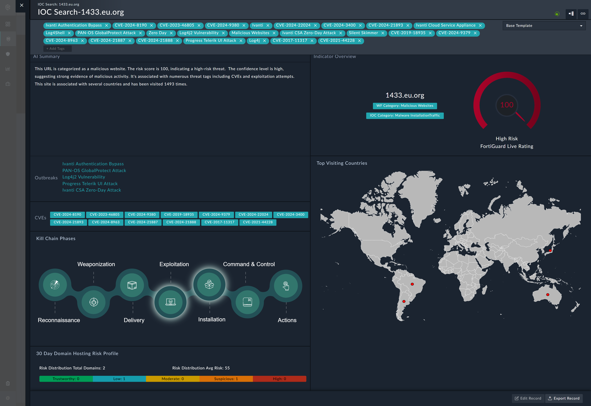

| [Home](../README.md) |
|----------------------|

# Usage

The Threat Intel Search page can be accessed from two locations:

1. Select **Threat Intel Search** from the **FortiGuard Labs** navigation menu.

2. Launch the **Threat Intel Search** dashboard.

On the Threat Intel Search page, enter indicators separated by a line break. Maximum of 10 indicators are allowed. Click the button  **Search** when done.

As an example let's enter the following indicators in the **Threat Intel Search** box and click **Search**:

```
goggle.com
46.105.221.247
148.251.55.110
185.15.247.147
145.239.33.100
82.102.14.219
94.23.172.164:80
1433.eu.org
```
The following is the results page after searching for these IOCs:


Click a record to view its details.

## Dashboard

The dashboard presents a threat intelligence snapshot of a high-risk IOC (`1433.eu.org`) based on *CVEs*, *outbreak mapping*, and *adversary tactics*. The following is a description of each section:



### AI Summary

Located at the top-center, this section provides an automated risk analysis summary. For example, for `1433.eu.org` you can see the following:

- **Risk Score**: 100 (High Risk)

- **Confidence Level**: High

- **Threat Indicators**: Strong evidence of malicious activity, exploitation attempts, and threat tags.

- **Reputation Insight**: Site visited over 1,493 times and tied to multiple geographies.

### Indicator Overview

Displays the risk score as a percentage value of the IOC. For example, for `1433.eu.org` you can see the following:

- Indicator: 1433.eu.org

- **Web Filter Category**: Malicious Websites

- **IOC Category**: Malware Installation/Traffic

- **Live Threat Score**: Visualized using a red dial gauge marked at 100 (maximum risk).

### Tags

A series of tags summarize the following:

- Associated CVE identifiers

- Named threats and exploits (For example: Log4J, Zero Day, Silent Skimmer)

- Mapped outbreaks and exploitation techniques

### Top Visiting Countries

The world map displays geo-located information:

- Red dots indicate top visitor origins (For example: East Asia, Australia, and South America).

- Useful for understanding global exposure and potential threat spread.


### Outbreaks

This section highlights active threat campaigns or vulnerabilities with which the IOC is associated. For example, for `1433.eu.org` you can see the following:

- Ivanti Authentication Bypass
- PAN-OS GlobalProtect Attack
- Log4J Vulnerability
- Progress Telerik UI Attack
- Ivanti CSA Zero-Day Attack

### CVEs

The CVE panel includes a horizontal scroll list of relevant vulnerabilities. For example, for `1433.eu.org` you can see the following:

- CVEs span from 2017 to 2024
- Includes critical flaws like `CVE-2024-8190`, `CVE-2023-46805`, `CVE-2017-11317`
- Helps contextualize how the threat is exploiting known weaknesses

### Kill Chain Phases

This section maps IOCs to Lockheed Martin's **Kill Chain Phases**: `Reconnaissance` > `Weaponization` > `Delivery` > `Exploitation` > `Installation` > `Command & Control` > `Actions`

- The phase in which the IOC currently is highlighted.
- Indicates that the IOC is tied to **full-lifecycle attack activity**

> [!Note]
> The phases do not appear highlighted in Mozilla's Firefox browser.

### 30-Day Domain Hosting Risk Profile

Displays hosting reputation and activity over the past month. For example, for `1433.eu.org` you can see the following:

- **Total Domains:** 2
- **Average Risk Score:** 55
- **Trust Level Distribution:**

  - High Risk: 1
  - Suspicious: 1
  - Moderate, Low, Trustworthy: 0

# Next Steps

| [Installation](./setup.md#installation) | [Configuration](./setup.md#configuration) | [Contents](./contents.md) |
|-----------------------------------------|-------------------------------------------|---------------------------|